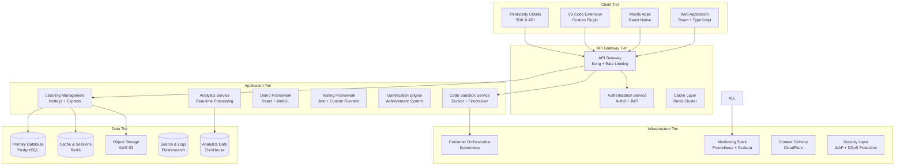

# OpenCode Platform Architecture Summary

## 🎯 Executive Summary

The OpenCode platform is a comprehensive, scalable learning management system designed to deliver interactive software development education. This architecture supports the complete learning journey from beginner to expert level, with advanced features including interactive demonstrations, code sandbox environments, automated testing, progress tracking, and gamification.

## 🏗️ Architecture Overview

### High-Level System Architecture



## 🔧 Core Components Architecture

### 1. Interactive Demonstration Framework

**Purpose**: Provide step-by-step, interactive learning experiences with real-time code visualization and user interaction.

**Key Features**:
- Real-time code highlighting and execution
- Algorithm visualization with D3.js and WebGL
- Interactive quizzes and assessments
- Multi-user demonstration support
- Branching learning paths

**Technology Stack**:
- Frontend: React + TypeScript + D3.js + WebGL
- Backend: Node.js + WebSocket for real-time sync
- Storage: Redis for session state, PostgreSQL for content

**Scalability**: Supports 10,000+ concurrent demo sessions with horizontal scaling

### 2. Code Sandbox Environment

**Purpose**: Secure, isolated code execution environment supporting multiple programming languages with real-time collaboration.

**Key Features**:
- Multi-language support (JavaScript, Python, Java, Go, Rust, C++)
- Secure container isolation with Firecracker microVMs
- Real-time collaborative editing
- Resource limits and security controls
- Persistent project snapshots

**Technology Stack**:
- Runtime: Firecracker microVMs on Kubernetes
- Languages: Node.js, Python, OpenJDK, Go, Rust, GCC
- Security: gVisor sandboxing, network isolation
- Collaboration: WebSockets + Operational Transformation

**Scalability**: Auto-scaling from 100 to 10,000 concurrent sandboxes

### 3. Automated Testing & Validation System

**Purpose**: Comprehensive automated testing, grading, and feedback generation for student code submissions.

**Key Features**:
- Multi-language test runners (Jest, pytest, JUnit)
- Code quality analysis (ESLint, SonarQube)
- Plagiarism detection with ML algorithms
- Automated feedback generation
- Performance benchmarking

**Technology Stack**:
- Test Frameworks: Jest, pytest, JUnit, custom runners
- Code Analysis: ESLint, Prettier, SonarQube, Semgrep
- ML: TensorFlow for plagiarism detection
- Reporting: Custom reporting engine

**Scalability**: Processes 1,000+ submissions per minute with queue-based architecture

### 4. Progress Tracking & Gamification

**Purpose**: Comprehensive learning analytics with gamification elements to enhance student engagement and retention.

**Key Features**:
- Real-time progress tracking across all modules
- Achievement system with 100+ achievements
- Leaderboards and competition features
- Personalized learning recommendations
- Predictive analytics for student success

**Technology Stack**:
- Analytics: ClickHouse for OLAP, Redis for real-time data
- ML: Python + scikit-learn for recommendations
- Visualization: Custom React components + Chart.js
- Notifications: WebSockets + Push notifications

**Scalability**: Handles millions of learning events per day

### 5. Multi-Language Support Engine

**Purpose**: Unified support for multiple programming languages with consistent execution, debugging, and analysis capabilities.

**Supported Languages**:
- **Primary**: JavaScript/TypeScript, Python
- **Secondary**: Java, Go, Rust, C++
- **Extensible**: Plugin architecture for additional languages

**Language Service Features**:
- Compilation and execution
- Syntax highlighting and IntelliSense
- Debugging support with breakpoints
- Code formatting and linting
- Cross-language code translation (experimental)

**Technology Stack**:
- Language Servers: LSP-compatible servers for each language
- Compilation: Docker containers with language toolchains
- Intelligence: Monaco Editor + Language Server Protocol
- Translation: Custom AST-based translation engine

## 📊 Data Architecture

### Database Design

```sql
-- Core entities with optimized indexing
CREATE TABLE users (
    id UUID PRIMARY KEY DEFAULT gen_random_uuid(),
    email VARCHAR(255) UNIQUE NOT NULL,
    username VARCHAR(50) UNIQUE NOT NULL,
    role user_role NOT NULL DEFAULT 'student',
    created_at TIMESTAMP DEFAULT CURRENT_TIMESTAMP,
    -- Additional user fields
    INDEX idx_email (email),
    INDEX idx_username (username),
    INDEX idx_role (role),
    INDEX idx_created_at (created_at)
);

-- Partitioned table for high-volume progress data
CREATE TABLE user_progress (
    id UUID PRIMARY KEY DEFAULT gen_random_uuid(),
    user_id UUID REFERENCES users(id),
    module_id UUID REFERENCES modules(id),
    lesson_id UUID REFERENCES lessons(id),
    status progress_status DEFAULT 'not_started',
    progress_percentage DECIMAL(5,2) DEFAULT 0,
    time_spent_minutes INTEGER DEFAULT 0,
    updated_at TIMESTAMP DEFAULT CURRENT_TIMESTAMP,
    UNIQUE(user_id, lesson_id)
) PARTITION BY RANGE (updated_at);

-- Time-series data for analytics
CREATE TABLE learning_events (
    id BIGSERIAL PRIMARY KEY,
    user_id UUID REFERENCES users(id),
    event_type VARCHAR(50) NOT NULL,
    event_data JSONB,
    timestamp TIMESTAMP DEFAULT CURRENT_TIMESTAMP,
    INDEX idx_user_timestamp (user_id, timestamp),
    INDEX idx_event_type (event_type),
    INDEX idx_timestamp (timestamp)
) PARTITION BY RANGE (timestamp);
```

### Caching Strategy

```yaml
cache_layers:
  cdn:
    provider: CloudFlare
    ttl: 86400  # 24 hours for static assets
    
  api_gateway:
    provider: Kong
    ttl: 300    # 5 minutes for API responses
    
  application:
    provider: Redis Cluster
    strategies:
      - user_sessions: 3600    # 1 hour
      - course_content: 1800   # 30 minutes
      - progress_data: 300     # 5 minutes
      - leaderboards: 60       # 1 minute
      
  database:
    query_cache: enabled
    connection_pooling: 100 connections
    read_replicas: 3
```

## 🔐 Security Architecture

### Security Layers

1. **Network Security**
   - WAF with OWASP rule sets
   - DDoS protection via CloudFlare
   - VPC with private subnets
   - mTLS for internal communication

2. **Application Security**
   - JWT authentication with RS256
   - OAuth2 integration (Google, GitHub)
   - RBAC with fine-grained permissions
   - Input validation and sanitization

3. **Sandbox Security**
   - Firecracker microVM isolation
   - gVisor runtime protection
   - Network segmentation
   - Resource limits (CPU, memory, disk, time)

4. **Data Security**
   - Encryption at rest (AES-256)
   - Encryption in transit (TLS 1.3)
   - AWS KMS for key management
   - Regular security audits

### Compliance

- **GDPR**: Right to be forgotten, data portability
- **COPPA**: Child privacy protection
- **FERPA**: Educational records protection
- **SOC2**: Security and availability controls

## ⚡ Performance & Scalability

### Performance Targets

```yaml
performance_targets:
  web_application:
    first_contentful_paint: <1.5s
    largest_contentful_paint: <2.5s
    cumulative_layout_shift: <0.1
    
  api_responses:
    p50: <100ms
    p95: <200ms
    p99: <500ms
    
  code_execution:
    startup_time: <2s
    execution_timeout: 30s
    concurrent_sandboxes: 10000+
    
  database:
    connection_pool: 100
    query_timeout: 5s
    read_replica_lag: <1s
```

### Scaling Strategy

```yaml
scaling_strategy:
  horizontal_scaling:
    web_tier:
      min_instances: 3
      max_instances: 50
      target_cpu: 70%
      
    api_tier:
      min_instances: 5
      max_instances: 100
      target_cpu: 70%
      
    sandbox_tier:
      min_instances: 2
      max_instances: 200
      target_memory: 80%
      
  vertical_scaling:
    database:
      cpu_cores: 8-32
      memory: 32GB-128GB
      storage: SSD with auto-scaling
      
    cache:
      memory: 16GB-64GB
      cluster_mode: enabled
      
  auto_scaling_triggers:
    - cpu_utilization > 70%
    - memory_utilization > 80%
    - request_rate > 1000/sec
    - response_time > 200ms p95
```

## 🔄 Deployment Architecture

### Multi-Environment Setup

```yaml
environments:
  development:
    purpose: Local development and testing
    infrastructure: Docker Compose
    database: PostgreSQL (single instance)
    cache: Redis (single instance)
    monitoring: Basic logging
    
  staging:
    purpose: Pre-production testing
    infrastructure: Kubernetes (single cluster)
    database: PostgreSQL (primary + 1 replica)
    cache: Redis (cluster mode)
    monitoring: Full monitoring stack
    
  production:
    purpose: Live platform
    infrastructure: Kubernetes (multi-region)
    database: PostgreSQL (primary + 3 replicas)
    cache: Redis (cluster with failover)
    monitoring: Full stack + alerting
    backup: Automated with PITR
```

### CI/CD Pipeline

```yaml
pipeline_stages:
  commit:
    - Code quality checks (ESLint, Prettier)
    - Unit tests (Jest, pytest)
    - Security scanning (Snyk, Semgrep)
    
  build:
    - Container image building
    - Integration tests
    - Performance tests
    
  deploy:
    - Staging deployment
    - E2E tests
    - Manual approval gate
    - Production deployment (blue-green)
    - Health checks and monitoring
    
  post_deploy:
    - Smoke tests
    - Performance monitoring
    - Rollback capability
```

## 📈 Monitoring & Observability

### Monitoring Stack

```yaml
monitoring_components:
  metrics:
    collection: Prometheus
    visualization: Grafana
    alerting: AlertManager
    retention: 90 days
    
  logging:
    collection: Fluentd
    storage: Elasticsearch
    visualization: Kibana
    retention: 30 days
    
  tracing:
    instrumentation: OpenTelemetry
    backend: Jaeger
    sampling_rate: 1%
    
  synthetic_monitoring:
    provider: Datadog Synthetics
    checks: API health, user journeys
    frequency: 1 minute
```

### Key Metrics

```typescript
interface PlatformMetrics {
  // Application metrics
  api_response_time: Histogram;
  api_error_rate: Counter;
  active_users: Gauge;
  concurrent_sandboxes: Gauge;
  
  // Business metrics
  user_registrations: Counter;
  lesson_completions: Counter;
  code_executions: Counter;
  achievement_unlocks: Counter;
  
  // Infrastructure metrics
  cpu_utilization: Gauge;
  memory_utilization: Gauge;
  disk_utilization: Gauge;
  network_throughput: Gauge;
  
  // Database metrics
  connection_pool_usage: Gauge;
  query_duration: Histogram;
  deadlock_count: Counter;
  replication_lag: Gauge;
}
```

## 🎯 Technology Decisions

### Technology Stack Rationale

| Component | Technology | Justification |
|-----------|------------|---------------|
| Frontend | React + TypeScript | Strong ecosystem, type safety, component reusability |
| Backend | Node.js + Express | JavaScript consistency, large ecosystem, good performance |
| Database | PostgreSQL | ACID compliance, JSON support, strong consistency |
| Cache | Redis | High performance, rich data structures, clustering support |
| Containers | Docker + Kubernetes | Industry standard, excellent orchestration |
| Sandbox | Firecracker + gVisor | Strong isolation, lightweight, security-focused |
| Monitoring | Prometheus + Grafana | Open source, powerful querying, extensive integrations |
| Message Queue | RabbitMQ | Reliable delivery, clustering, management interface |

### Alternative Considerations

| Decision | Alternative | Why Not Chosen |
|----------|-------------|----------------|
| PostgreSQL | MongoDB | Need ACID transactions, complex queries |
| Redis | Memcached | Need data structures, persistence |
| Kubernetes | Docker Swarm | Need advanced orchestration features |
| Firecracker | Docker | Need stronger security isolation |
| React | Vue.js | Larger ecosystem, better TypeScript support |

## 🔮 Future Enhancements

### Planned Features (6-12 months)

1. **AI-Powered Learning Assistant**
   - Personalized learning paths
   - Code review and suggestions
   - Natural language to code conversion
   - Intelligent tutoring system

2. **Advanced Analytics**
   - Learning pattern analysis
   - Predictive modeling for student success
   - Adaptive curriculum recommendations
   - Real-time intervention triggers

3. **Mobile Native Experience**
   - Offline learning capability
   - Mobile code editor with syntax highlighting
   - Push notifications for learning reminders
   - Mobile-optimized interactive demos

4. **Enterprise Features**
   - SSO integration (SAML, LDAP)
   - Team management and collaboration
   - Custom branding and white-labeling
   - Advanced reporting and analytics

### Experimental Features (12+ months)

1. **Virtual Reality Learning Labs**
   - 3D visualization of algorithms and data structures
   - Immersive debugging environments
   - Collaborative VR coding sessions
   - Virtual pair programming

2. **Blockchain Credentials**
   - Verifiable certificates and achievements
   - Skill verification NFTs
   - Decentralized reputation system
   - Smart contract-based assessments

3. **Quantum Computing Module**
   - Quantum algorithm visualization
   - Quantum simulator integration
   - Introduction to quantum programming
   - Hybrid classical-quantum problems

## 💰 Cost Optimization

### Resource Optimization

```yaml
cost_optimization:
  compute:
    - Auto-scaling based on actual usage
    - Spot instances for non-critical workloads
    - Reserved instances for predictable workloads
    - Right-sizing based on monitoring data
    
  storage:
    - Lifecycle policies for S3 objects
    - Database storage optimization
    - Log retention policies
    - Image optimization and compression
    
  networking:
    - CDN for static asset delivery
    - Regional deployment to reduce latency
    - Compression for API responses
    - Efficient caching strategies
    
  monitoring:
    - Metrics aggregation to reduce costs
    - Sampling for high-volume traces
    - Log filtering and aggregation
    - Automated alerting to prevent issues
```

### Estimated Costs

| Component | Monthly Cost (1K users) | Monthly Cost (10K users) | Monthly Cost (100K users) |
|-----------|-------------------------|--------------------------|---------------------------|
| Compute (EKS) | $500 | $2,000 | $8,000 |
| Database (RDS) | $200 | $800 | $3,200 |
| Cache (ElastiCache) | $100 | $400 | $1,600 |
| Storage (S3) | $50 | $200 | $1,000 |
| CDN (CloudFlare) | $20 | $100 | $500 |
| Monitoring | $100 | $300 | $1,000 |
| **Total** | **$970** | **$3,800** | **$15,300** |

## 🎯 Success Metrics

### Technical KPIs

- **Availability**: 99.95% uptime
- **Performance**: <200ms API response time (p95)
- **Scalability**: Support 100K+ concurrent users
- **Security**: Zero critical security incidents
- **Reliability**: <0.1% error rate

### Business KPIs

- **User Engagement**: >80% course completion rate
- **Learning Effectiveness**: >70% skill improvement
- **User Satisfaction**: >4.5/5 rating
- **Platform Growth**: 50% user growth annually
- **Job Placement**: >85% job placement rate

---

This architecture provides a robust, scalable foundation for the OpenCode platform that can grow from hundreds to hundreds of thousands of users while maintaining excellent performance, security, and reliability. The modular design allows for incremental improvements and feature additions without disrupting the core platform.