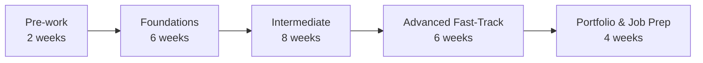
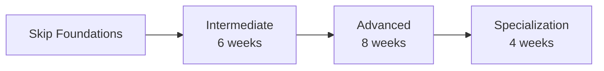
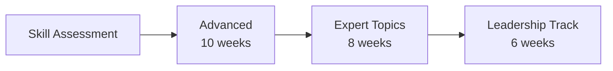
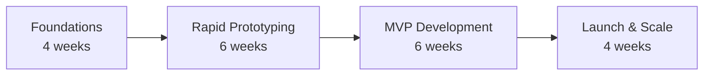

# OpenCode Learning Pathways Guide

## 🎯 Choose Your Journey

This guide helps you navigate the OpenCode course based on your goals, background, and learning style. Each pathway is optimized for different career objectives and time commitments.

## 📊 Quick Assessment

### Current Skill Level Assessment

**Complete Beginner (Start with Foundations)**
- [ ] Never written code before
- [ ] Unfamiliar with command line/terminal
- [ ] Don't know what Git is
- [ ] Haven't built a website

**Some Experience (Consider Foundations Fast-Track or Intermediate)**
- [ ] Written some HTML/CSS
- [ ] Basic JavaScript knowledge
- [ ] Used Git occasionally
- [ ] Built simple websites

**Junior Developer (Start with Intermediate)**
- [ ] 6-12 months coding experience
- [ ] Comfortable with one language
- [ ] Basic understanding of databases
- [ ] Can build simple applications

**Experienced Developer (Start with Advanced)**
- [ ] 1-2 years professional experience
- [ ] Full-stack development skills
- [ ] Deployed production applications
- [ ] Familiar with cloud services

**Senior Developer (Consider Expert or Specialized Tracks)**
- [ ] 3+ years professional experience
- [ ] Led technical projects
- [ ] Mentored other developers
- [ ] Architected complex systems

---

## 🚀 Learning Pathways

### 🌟 Path 1: Career Changer (Bootcamp Style)
**Goal**: Transition to software development career  
**Duration**: 6-9 months intensive  
**Time Commitment**: 40-60 hours/week  



**Curriculum Focus**:
- Week 1-2: **Pre-work** - Computer basics, environment setup
- Week 3-8: **Foundations** - Programming fundamentals, web basics
- Week 9-16: **Intermediate** - Full-stack development, databases
- Week 17-22: **Advanced Topics** - Cloud, DevOps, system design
- Week 23-26: **Job Preparation** - Portfolio, interviews, networking

**Key Outcomes**:
- 5-7 portfolio projects
- Job-ready full-stack skills
- Interview preparation
- Industry connections

### 🎓 Path 2: Computer Science Complement
**Goal**: Practical skills to complement CS degree  
**Duration**: 4-6 months part-time  
**Time Commitment**: 15-20 hours/week  



**Curriculum Focus**:
- **Intermediate**: Modern web frameworks, practical databases
- **Advanced**: Cloud architecture, DevOps practices
- **Specialization**: Choose ML, mobile, or blockchain track

**Key Outcomes**:
- Industry-relevant skills
- Open source contributions
- Internship readiness
- Real-world project experience

### 💼 Path 3: Professional Upskilling
**Goal**: Advance from junior to senior developer  
**Duration**: 6-8 months part-time  
**Time Commitment**: 10-15 hours/week  



**Curriculum Focus**:
- **Advanced**: Architecture patterns, performance, security
- **Expert**: Distributed systems, emerging tech
- **Leadership**: Technical leadership, mentoring, strategy

**Key Outcomes**:
- Senior-level competencies
- Architecture skills
- Leadership preparation
- Significant salary increase potential

### 🚀 Path 4: Entrepreneurial Track
**Goal**: Build technical skills for startup founding  
**Duration**: 4-5 months intensive  
**Time Commitment**: 30-40 hours/week  



**Curriculum Focus**:
- **Foundations**: Quick ramp-up on essentials
- **Prototyping**: Multiple frameworks, rapid development
- **MVP**: Full-stack, payments, authentication
- **Scale**: Cloud, performance, growth hacking

**Key Outcomes**:
- Launch-ready MVP
- Full-stack capabilities
- Cloud deployment skills
- Growth engineering basics

### 🎯 Path 5: Specialist Tracks
**Goal**: Deep expertise in specific domain  
**Duration**: 3-4 months focused  
**Time Commitment**: 20-25 hours/week  

#### Track Options:

**🤖 AI/ML Engineering**
```
Intermediate Python → ML Fundamentals → Deep Learning → MLOps
```

**📱 Mobile Development**
```
Intermediate JS → React Native → iOS/Android → App Store Deployment
```

**🔐 Security Engineering**
```
Advanced Systems → Security Fundamentals → Penetration Testing → DevSecOps
```

**⛓️ Blockchain Development**
```
Advanced Programming → Smart Contracts → DeFi → Web3 Architecture
```

**🎮 Game Development**
```
Intermediate C++ → Game Engines → Graphics → Multiplayer Systems
```

---

## 📈 Progression Strategies

### 🏃 Fast-Track Options

**Foundations Fast-Track** (3 weeks)
- Prerequisites: Some programming exposure
- Intensive: 60+ hours/week
- Outcome: Ready for Intermediate

**Intermediate Accelerated** (4 weeks)
- Prerequisites: Strong foundations
- Intensive: 50+ hours/week
- Outcome: Ready for Advanced

**Advanced Intensive** (6 weeks)
- Prerequisites: 1+ year experience
- Intensive: 40+ hours/week
- Outcome: Senior-level skills

### 🚶 Self-Paced Options

**Evening & Weekend** (12-18 months)
- 10-15 hours/week
- Flexible scheduling
- Work-compatible

**Summer Intensive** (3 months)
- Full-time summer commitment
- Complete 2-3 modules
- Return to school/work ready

**Gap Year Program** (9-12 months)
- Comprehensive coverage
- Internship integration
- Travel-friendly online

---

## 🎯 Skill-Based Pathways

### Frontend Specialist
```yaml
pathway:
  foundation:
    - HTML/CSS mastery
    - JavaScript fundamentals
    - Responsive design
  
  intermediate:
    - React/Vue.js
    - State management
    - Testing
  
  advanced:
    - Performance optimization
    - Accessibility
    - Micro-frontends
  
  expert:
    - Design systems
    - WebAssembly
    - Framework development
```

### Backend Specialist
```yaml
pathway:
  foundation:
    - Programming basics
    - Databases
    - APIs
  
  intermediate:
    - Node.js/Python
    - Authentication
    - Microservices
  
  advanced:
    - Distributed systems
    - Event-driven architecture
    - Performance tuning
  
  expert:
    - System design
    - Infrastructure
    - Technical leadership
```

### DevOps Specialist
```yaml
pathway:
  foundation:
    - Linux fundamentals
    - Scripting
    - Version control
  
  intermediate:
    - Docker
    - CI/CD
    - Cloud basics
  
  advanced:
    - Kubernetes
    - Infrastructure as Code
    - Monitoring
  
  expert:
    - Platform engineering
    - SRE practices
    - Cost optimization
```

---

## 📊 Learning Style Adaptations

### 🎥 Visual Learners
- Video-first content
- Diagramming exercises
- Visual debugging tools
- Architecture visualization

### 📖 Reading/Writing Learners
- Comprehensive documentation
- Technical writing assignments
- Code commenting practice
- Blog post requirements

### 🤝 Kinesthetic Learners
- Hands-on projects from day 1
- Pair programming sessions
- Live coding exercises
- Hackathon participation

### 👂 Auditory Learners
- Recorded lectures
- Podcast supplements
- Discussion groups
- Verbal explanations

---

## 🗺️ Career Outcome Mapping

### By Target Role

**Frontend Developer**
- Modules: Foundations → Intermediate (frontend focus)
- Timeline: 3-4 months
- Key Skills: React, CSS, UX
- Salary Range: $60-90k

**Full-Stack Developer**
- Modules: All core modules
- Timeline: 6-8 months
- Key Skills: MERN/MEAN stack
- Salary Range: $70-110k

**DevOps Engineer**
- Modules: Intermediate → Advanced (DevOps focus)
- Timeline: 5-6 months
- Key Skills: K8s, CI/CD, Cloud
- Salary Range: $90-130k

**Software Architect**
- Modules: All modules + Expert
- Timeline: 10-12 months
- Key Skills: System design, Leadership
- Salary Range: $130-180k+

**Technical Founder**
- Modules: Custom entrepreneurial track
- Timeline: 4-5 months
- Key Skills: Full-stack, Cloud, Business
- Outcome: Launch-ready

---

## 💡 Choosing Your Path

### Decision Framework

1. **Assess Current Skills**
   - Take placement quiz
   - Review prerequisites
   - Identify gaps

2. **Define Goals**
   - Career change?
   - Promotion?
   - Startup?
   - Specialization?

3. **Consider Constraints**
   - Available time
   - Financial resources
   - Learning style
   - Support needs

4. **Match to Pathway**
   - Use decision tree
   - Consult advisors
   - Review outcomes

### Decision Tree
```
Start: What's your primary goal?
├── Get first developer job
│   ├── Have 40+ hrs/week? → Bootcamp Path
│   └── Part-time only? → Extended Career Change
├── Advance career
│   ├── Junior now? → Professional Upskilling
│   └── Senior now? → Expert Leadership
├── Start a company
│   └── → Entrepreneurial Track
└── Specialize deeply
    └── Choose domain → Specialist Track
```

---

## 📅 Sample Schedules

### Full-Time Bootcamp Schedule
**Monday-Friday**
- 9:00-10:30: Lecture/Theory
- 10:45-12:30: Guided Practice
- 1:30-3:30: Project Work
- 3:45-5:00: Peer Programming
- 5:00-6:00: Review/Office Hours

### Part-Time Professional Schedule
**Weekday Evenings**
- 6:30-8:00: Video Lessons
- 8:00-9:30: Coding Practice

**Weekends**
- Saturday: 4-hour project block
- Sunday: 2-hour review/planning

### Self-Paced Flexible Schedule
- **Weekly Goals**: Complete 2-3 lessons
- **Project Milestones**: Bi-weekly
- **Check-ins**: Weekly mentor call
- **Flexibility**: Pause/resume as needed

---

## 🎯 Success Tips by Pathway

### Career Changers
1. **Immerse completely** - Treat it like a job
2. **Network actively** - Attend all events
3. **Build constantly** - Ship code daily
4. **Document journey** - Blog your progress

### CS Students
1. **Focus on practical** - Build real things
2. **Contribute to open source** - Start early
3. **Seek internships** - Apply knowledge
4. **Join communities** - Expand beyond academia

### Working Professionals
1. **Apply at work** - Use new skills immediately
2. **Time-box learning** - Consistent > intensive
3. **Find accountability** - Study buddy
4. **Negotiate support** - Get employer backing

### Entrepreneurs
1. **Build your idea** - Use as course project
2. **Validate constantly** - Talk to users
3. **Focus on shipping** - Perfect is enemy of done
4. **Network strategically** - Find co-founders

---

## 🚀 Next Steps

1. **Take Assessment**: Determine your starting point
2. **Choose Pathway**: Select based on goals
3. **Set Schedule**: Commit to timeline
4. **Join Community**: Connect with cohort
5. **Start Learning**: Begin your journey!

### Resources
- **Pathway Advisor**: Schedule 1-on-1 consultation
- **Community Forum**: Connect with others on same path
- **Success Stories**: Read about alumni journeys
- **FAQ**: Common questions by pathway

---

**Ready to start your personalized learning journey? Your future in tech awaits! 🌟**