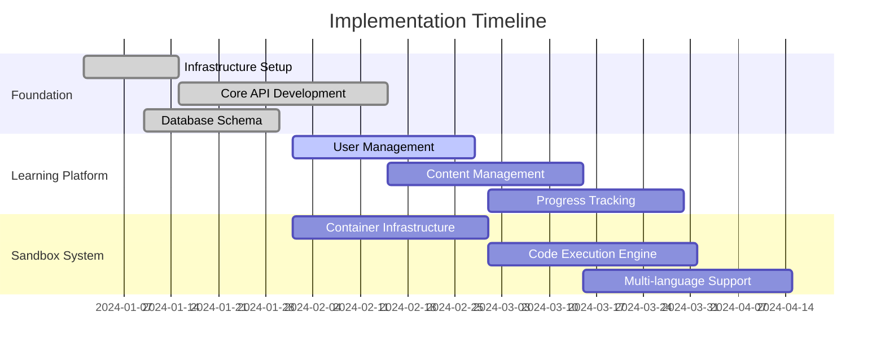

# OpenCode System Implementation Guide

## 🚀 Implementation Roadmap

### Phase 1: Core Platform (Months 1-3)


### Phase 2: Advanced Features (Months 4-6)
- Interactive demonstration framework
- Automated testing and validation
- Gamification engine
- Advanced analytics

### Phase 3: Scale & Polish (Months 7-9)
- Performance optimization
- Mobile applications
- AI-powered features
- Enterprise integrations

## 🏗️ Detailed Component Architecture

### 1. Interactive Demonstration Framework

#### Component Structure
```
/src/demo-framework/
├── core/
│   ├── DemoEngine.ts          # Main demo orchestrator
│   ├── StepManager.ts         # Step-by-step control
│   ├── InteractionHandler.ts  # User interaction processing
│   └── StateManager.ts        # Demo state management
├── visualization/
│   ├── CodeHighlighter.ts     # Syntax highlighting with steps
│   ├── AlgorithmVisualizer.ts # Algorithm animation
│   ├── DataStructureView.ts   # Data structure visualization
│   └── ArchitectureDiagram.ts # System architecture display
├── ui/
│   ├── DemoPlayer.tsx         # Main demo player component
│   ├── InteractiveOverlay.tsx # Interactive elements overlay
│   ├── ProgressIndicator.tsx  # Demo progress display
│   └── ControlPanel.tsx       # Demo controls
└── types/
    ├── DemoTypes.ts           # TypeScript definitions
    ├── VisualizationTypes.ts  # Visualization interfaces
    └── InteractionTypes.ts    # Interaction definitions
```

#### Demo Definition Schema
```typescript
interface DemoDefinition {
  id: string;
  title: string;
  description: string;
  duration: number;
  difficulty: 'beginner' | 'intermediate' | 'advanced' | 'expert';
  
  steps: DemoStep[];
  interactions: InteractionPoint[];
  assessments: MicroAssessment[];
  resources: Resource[];
  
  metadata: {
    tags: string[];
    prerequisites: string[];
    learningObjectives: string[];
    author: string;
    version: string;
  };
}

interface DemoStep {
  id: string;
  type: 'explanation' | 'code' | 'visualization' | 'interaction';
  title: string;
  content: StepContent;
  timing: {
    autoAdvance: boolean;
    duration?: number;
    pausePoints: number[];
  };
  validation?: StepValidation;
}

interface StepContent {
  text?: string;
  code?: CodeBlock;
  visualization?: VisualizationConfig;
  media?: MediaElement[];
  quiz?: QuickQuiz;
}
```

#### Implementation Example
```typescript
// DemoEngine.ts
export class DemoEngine {
  private currentDemo: DemoDefinition | null = null;
  private currentStep = 0;
  private stepManager: StepManager;
  private interactionHandler: InteractionHandler;
  private stateManager: StateManager;
  
  constructor(
    private visualizer: VisualizationEngine,
    private eventBus: EventBus
  ) {
    this.stepManager = new StepManager(this.eventBus);
    this.interactionHandler = new InteractionHandler(this.eventBus);
    this.stateManager = new StateManager();
  }
  
  async loadDemo(demoId: string): Promise<void> {
    this.currentDemo = await this.loadDemoDefinition(demoId);
    this.currentStep = 0;
    this.stateManager.initializeState(this.currentDemo);
    this.eventBus.emit('demo:loaded', this.currentDemo);
  }
  
  async nextStep(): Promise<void> {
    if (!this.currentDemo || this.currentStep >= this.currentDemo.steps.length) {
      return;
    }
    
    const step = this.currentDemo.steps[this.currentStep];
    
    // Validate current step if required
    if (step.validation && !await this.validateStep(step)) {
      this.eventBus.emit('step:validation-failed', step);
      return;
    }
    
    this.currentStep++;
    await this.executeStep(step);
    this.eventBus.emit('step:advanced', { step, index: this.currentStep });
  }
  
  private async executeStep(step: DemoStep): Promise<void> {
    switch (step.type) {
      case 'code':
        await this.executeCodeStep(step);
        break;
      case 'visualization':
        await this.executeVisualizationStep(step);
        break;
      case 'interaction':
        await this.executeInteractionStep(step);
        break;
      default:
        await this.executeExplanationStep(step);
    }
  }
}
```

### 2. Code Sandbox Service

#### Sandbox Architecture
```
/src/sandbox-service/
├── core/
│   ├── SandboxManager.ts      # Sandbox lifecycle management
│   ├── ExecutionEngine.ts     # Code execution orchestrator
│   ├── SecurityLayer.ts       # Security and isolation
│   └── ResourceManager.ts     # Resource allocation and limits
├── languages/
│   ├── JavaScript/
│   │   ├── JSRunner.ts        # Node.js execution
│   │   ├── TypeScriptRunner.ts # TS compilation and execution
│   │   └── BrowserRunner.ts   # Browser environment simulation
│   ├── Python/
│   │   ├── PythonRunner.ts    # Python execution
│   │   └── JupyterRunner.ts   # Jupyter notebook support
│   └── shared/
│       ├── BaseRunner.ts      # Common runner interface
│       └── LanguageDetector.ts # Auto-detect language
├── containers/
│   ├── DockerManager.ts       # Container lifecycle
│   ├── ImageBuilder.ts        # Custom image creation
│   └── NetworkIsolation.ts    # Network security
├── collaboration/
│   ├── SessionManager.ts      # Multi-user sessions
│   ├── ChangeSync.ts          # Real-time sync
│   └── ConflictResolver.ts    # Merge conflict handling
└── api/
    ├── SandboxController.ts   # REST API endpoints
    ├── WebSocketHandler.ts    # Real-time communication
    └── GraphQLResolver.ts     # GraphQL queries
```

#### Sandbox Security Model
```typescript
interface SandboxConfig {
  language: SupportedLanguage;
  timeLimit: number;        // Maximum execution time (seconds)
  memoryLimit: number;      // Maximum memory usage (MB)
  diskLimit: number;        // Maximum disk usage (MB)
  
  networkAccess: {
    enabled: boolean;
    allowedDomains: string[];
    blockedPorts: number[];
  };
  
  permissions: {
    fileSystem: FileSystemPermissions;
    systemCalls: SystemCallPermissions;
    environment: EnvironmentPermissions;
  };
  
  packages: {
    allowed: PackageRestriction[];
    preinstalled: string[];
  };
}

class SandboxSecurityLayer {
  private readonly BLOCKED_IMPORTS = [
    'os', 'subprocess', 'socket', 'urllib',
    'fs', 'child_process', 'net', 'dgram'
  ];
  
  validateCode(code: string, language: SupportedLanguage): ValidationResult {
    const violations: SecurityViolation[] = [];
    
    // Check for dangerous imports
    violations.push(...this.checkDangerousImports(code, language));
    
    // Check for system calls
    violations.push(...this.checkSystemCalls(code, language));
    
    // Check for infinite loops
    violations.push(...this.checkInfiniteLoops(code, language));
    
    // Check for resource exhaustion attempts
    violations.push(...this.checkResourceExhaustion(code, language));
    
    return {
      isValid: violations.length === 0,
      violations,
      sanitizedCode: this.sanitizeCode(code, violations)
    };
  }
  
  private checkDangerousImports(code: string, language: SupportedLanguage): SecurityViolation[] {
    const violations: SecurityViolation[] = [];
    const importPattern = this.getImportPattern(language);
    
    const imports = code.match(importPattern) || [];
    
    for (const importStatement of imports) {
      const module = this.extractModuleName(importStatement, language);
      if (this.BLOCKED_IMPORTS.includes(module)) {
        violations.push({
          type: 'dangerous_import',
          severity: 'high',
          message: `Blocked import: ${module}`,
          line: this.getLineNumber(code, importStatement)
        });
      }
    }
    
    return violations;
  }
}
```

### 3. Automated Testing & Validation System

#### Testing Framework Architecture
```
/src/testing-framework/
├── core/
│   ├── TestRunner.ts          # Main test orchestrator
│   ├── TestSuiteManager.ts    # Test suite management
│   ├── AssertionEngine.ts     # Custom assertions
│   └── ReportGenerator.ts     # Test report generation
├── runners/
│   ├── UnitTestRunner.ts      # Unit test execution
│   ├── IntegrationTestRunner.ts # Integration tests
│   ├── PerformanceTestRunner.ts # Performance benchmarks
│   └── SecurityTestRunner.ts   # Security validation
├── validators/
│   ├── CodeQualityValidator.ts # Code quality checks
│   ├── StyleValidator.ts       # Code style enforcement
│   ├── ComplexityValidator.ts  # Complexity analysis
│   └── PlagiarismValidator.ts  # Plagiarism detection
├── feedback/
│   ├── FeedbackGenerator.ts   # Automated feedback
│   ├── HintProvider.ts        # Contextual hints
│   └── SolutionComparator.ts  # Solution analysis
└── grading/
    ├── AutoGrader.ts          # Automated grading
    ├── RubricEngine.ts        # Rubric-based grading
    └── ScoreCalculator.ts     # Score computation
```

#### Test Definition Schema
```typescript
interface TestSuite {
  id: string;
  name: string;
  description: string;
  exercise_id: string;
  language: SupportedLanguage;
  
  setup?: TestSetup;
  teardown?: TestTeardown;
  
  tests: TestCase[];
  performance_benchmarks?: PerformanceBenchmark[];
  quality_checks: QualityCheck[];
  
  grading: GradingRubric;
}

interface TestCase {
  id: string;
  name: string;
  description: string;
  type: 'unit' | 'integration' | 'functional' | 'edge_case';
  
  input: TestInput;
  expected: ExpectedOutput;
  timeout: number;
  points: number;
  
  hints?: Hint[];
  explanation?: string;
}

interface GradingRubric {
  total_points: number;
  
  weights: {
    correctness: number;     // 0-1
    performance: number;     // 0-1
    code_quality: number;    // 0-1
    style: number;          // 0-1
  };
  
  thresholds: {
    passing_grade: number;   // Minimum percentage to pass
    excellence_grade: number; // Threshold for excellence
  };
  
  penalties: {
    late_submission: number;
    style_violations: number;
    plagiarism: number;
  };
}
```

#### Auto-Grading Implementation
```typescript
class AutoGrader {
  constructor(
    private testRunner: TestRunner,
    private qualityValidator: CodeQualityValidator,
    private performanceAnalyzer: PerformanceAnalyzer,
    private plagiarismDetector: PlagiarismDetector
  ) {}
  
  async gradeSubmission(submission: CodeSubmission): Promise<GradingResult> {
    const testSuite = await this.loadTestSuite(submission.exercise_id);
    
    // Execute all tests
    const testResults = await this.testRunner.runTestSuite(
      testSuite,
      submission.code
    );
    
    // Analyze code quality
    const qualityResults = await this.qualityValidator.analyze(
      submission.code,
      testSuite.language
    );
    
    // Check performance
    const performanceResults = await this.performanceAnalyzer.benchmark(
      submission.code,
      testSuite.performance_benchmarks || []
    );
    
    // Detect plagiarism
    const plagiarismResults = await this.plagiarismDetector.check(
      submission.code,
      submission.exercise_id
    );
    
    // Calculate final score
    const score = this.calculateScore(
      testResults,
      qualityResults,
      performanceResults,
      plagiarismResults,
      testSuite.grading
    );
    
    // Generate feedback
    const feedback = await this.generateFeedback(
      testResults,
      qualityResults,
      performanceResults,
      plagiarismResults
    );
    
    return {
      score,
      feedback,
      breakdown: {
        correctness: testResults.score,
        quality: qualityResults.score,
        performance: performanceResults.score,
        style: qualityResults.styleScore
      },
      recommendations: this.generateRecommendations(
        testResults,
        qualityResults,
        performanceResults
      )
    };
  }
  
  private calculateScore(
    testResults: TestResults,
    qualityResults: QualityResults,
    performanceResults: PerformanceResults,
    plagiarismResults: PlagiarismResults,
    rubric: GradingRubric
  ): number {
    if (plagiarismResults.confidence > 0.8) {
      return 0; // Zero score for high confidence plagiarism
    }
    
    const correctnessScore = testResults.score * rubric.weights.correctness;
    const qualityScore = qualityResults.score * rubric.weights.code_quality;
    const performanceScore = performanceResults.score * rubric.weights.performance;
    const styleScore = qualityResults.styleScore * rubric.weights.style;
    
    const baseScore = correctnessScore + qualityScore + performanceScore + styleScore;
    
    // Apply penalties
    let finalScore = baseScore;
    finalScore -= qualityResults.violations.length * rubric.penalties.style_violations;
    finalScore -= plagiarismResults.confidence * rubric.penalties.plagiarism;
    
    return Math.max(0, Math.min(100, finalScore));
  }
}
```

### 4. Progress Tracking & Gamification

#### Progress Tracking System
```
/src/progress-tracking/
├── core/
│   ├── ProgressTracker.ts     # Main progress tracking
│   ├── AnalyticsEngine.ts     # Learning analytics
│   ├── SkillAssessment.ts     # Skill level evaluation
│   └── PathwayManager.ts      # Learning pathway optimization
├── gamification/
│   ├── AchievementEngine.ts   # Achievement processing
│   ├── PointSystem.ts         # Point allocation and tracking
│   ├── BadgeManager.ts        # Badge system
│   └── LeaderboardManager.ts  # Leaderboard computation
├── analytics/
│   ├── LearningAnalytics.ts   # Learning pattern analysis
│   ├── EngagementMetrics.ts   # Engagement tracking
│   ├── PredictiveModels.ts    # Predictive analytics
│   └── ReportGenerator.ts     # Analytics reports
└── recommendations/
    ├── ContentRecommendation.ts # Content recommendation engine
    ├── PeerMatching.ts         # Study partner matching
    └── CareerGuidance.ts       # Career path suggestions
```

#### Achievement System Implementation
```typescript
interface Achievement {
  id: string;
  name: string;
  description: string;
  category: AchievementCategory;
  rarity: 'common' | 'rare' | 'epic' | 'legendary';
  
  icon: string;
  badge_color: string;
  xp_reward: number;
  unlock_content?: string[];
  
  conditions: AchievementCondition[];
  dependencies?: string[]; // Other achievement IDs
  
  metadata: {
    created_by: string;
    created_at: Date;
    statistics: AchievementStats;
  };
}

interface AchievementCondition {
  type: 'metric' | 'event' | 'streak' | 'milestone';
  metric?: string;
  operator?: 'gte' | 'lte' | 'eq' | 'gt' | 'lt';
  value?: number;
  event?: string;
  timeframe?: string; // e.g., "7d", "30d", "1y"
}

class AchievementEngine {
  private achievements: Map<string, Achievement> = new Map();
  private userProgress: Map<string, UserProgress> = new Map();
  
  async processUserEvent(userId: string, event: UserEvent): Promise<Achievement[]> {
    const unlockedAchievements: Achievement[] = [];
    const userProgress = await this.getUserProgress(userId);
    
    for (const achievement of this.achievements.values()) {
      if (await this.checkAchievementConditions(achievement, userProgress, event)) {
        if (!userProgress.achievements.has(achievement.id)) {
          unlockedAchievements.push(achievement);
          await this.unlockAchievement(userId, achievement);
        }
      }
    }
    
    return unlockedAchievements;
  }
  
  private async checkAchievementConditions(
    achievement: Achievement,
    userProgress: UserProgress,
    event: UserEvent
  ): Promise<boolean> {
    // Check dependencies first
    if (achievement.dependencies) {
      for (const depId of achievement.dependencies) {
        if (!userProgress.achievements.has(depId)) {
          return false;
        }
      }
    }
    
    // Check all conditions
    for (const condition of achievement.conditions) {
      if (!await this.evaluateCondition(condition, userProgress, event)) {
        return false;
      }
    }
    
    return true;
  }
  
  private async evaluateCondition(
    condition: AchievementCondition,
    userProgress: UserProgress,
    event: UserEvent
  ): Promise<boolean> {
    switch (condition.type) {
      case 'metric':
        return this.evaluateMetricCondition(condition, userProgress);
        
      case 'event':
        return this.evaluateEventCondition(condition, event);
        
      case 'streak':
        return this.evaluateStreakCondition(condition, userProgress);
        
      case 'milestone':
        return this.evaluateMilestoneCondition(condition, userProgress);
        
      default:
        return false;
    }
  }
}
```

#### Gamification Dashboard
```typescript
// GamificationDashboard.tsx
export const GamificationDashboard: React.FC<{ userId: string }> = ({ userId }) => {
  const [userStats, setUserStats] = useState<UserGameStats | null>(null);
  const [recentAchievements, setRecentAchievements] = useState<Achievement[]>([]);
  const [leaderboardData, setLeaderboardData] = useState<LeaderboardEntry[]>([]);
  
  useEffect(() => {
    const loadDashboardData = async () => {
      const [stats, achievements, leaderboard] = await Promise.all([
        gamificationAPI.getUserStats(userId),
        gamificationAPI.getRecentAchievements(userId),
        gamificationAPI.getLeaderboard('weekly')
      ]);
      
      setUserStats(stats);
      setRecentAchievements(achievements);
      setLeaderboardData(leaderboard);
    };
    
    loadDashboardData();
  }, [userId]);
  
  return (
    <div className="gamification-dashboard">
      <div className="stats-overview">
        <StatCard
          title="Total XP"
          value={userStats?.totalXP || 0}
          icon="⭐"
          trend={userStats?.xpTrend}
        />
        <StatCard
          title="Achievements"
          value={userStats?.achievementCount || 0}
          icon="🏆"
          subtitle={`${userStats?.rareAchievements || 0} rare`}
        />
        <StatCard
          title="Current Streak"
          value={userStats?.currentStreak || 0}
          icon="🔥"
          subtitle="days"
        />
        <StatCard
          title="Global Rank"
          value={userStats?.globalRank || 'Unranked'}
          icon="🥇"
          subtitle={`Top ${userStats?.percentile || 0}%`}
        />
      </div>
      
      <div className="recent-achievements">
        <h3>Recent Achievements</h3>
        <AchievementsList achievements={recentAchievements} />
      </div>
      
      <div className="leaderboard">
        <h3>Weekly Leaderboard</h3>
        <LeaderboardTable data={leaderboardData} currentUser={userId} />
      </div>
      
      <div className="progress-visualization">
        <h3>Learning Progress</h3>
        <SkillRadarChart skills={userStats?.skills || []} />
      </div>
    </div>
  );
};
```

### 5. Multi-Language Support Implementation

#### Language Service Architecture
```typescript
abstract class LanguageRunner {
  abstract language: SupportedLanguage;
  abstract fileExtension: string;
  abstract version: string;
  
  abstract compile(code: string): Promise<CompilationResult>;
  abstract execute(compiledCode: any, input?: string): Promise<ExecutionResult>;
  abstract validate(code: string): Promise<ValidationResult>;
  abstract getDocumentation(symbol: string): Promise<Documentation>;
  
  // Common functionality
  protected async createSandbox(): Promise<Sandbox> {
    return await this.sandboxManager.createSandbox({
      language: this.language,
      timeLimit: 30,
      memoryLimit: 512,
      diskLimit: 100
    });
  }
  
  protected async cleanup(sandbox: Sandbox): Promise<void> {
    await this.sandboxManager.destroySandbox(sandbox.id);
  }
}

class JavaScriptRunner extends LanguageRunner {
  language = 'javascript' as const;
  fileExtension = '.js';
  version = 'Node.js 20.0.0';
  
  async compile(code: string): Promise<CompilationResult> {
    // JavaScript doesn't need compilation, but we can do syntax checking
    try {
      // Use ESLint for syntax validation
      const lintResults = await this.eslint.lintText(code);
      
      return {
        success: lintResults.every(result => result.errorCount === 0),
        errors: lintResults.flatMap(result => 
          result.messages.filter(msg => msg.severity === 2)
        ),
        warnings: lintResults.flatMap(result => 
          result.messages.filter(msg => msg.severity === 1)
        ),
        compiledCode: code
      };
    } catch (error) {
      return {
        success: false,
        errors: [{ message: error.message, line: 0, column: 0 }],
        warnings: [],
        compiledCode: null
      };
    }
  }
  
  async execute(code: string, input?: string): Promise<ExecutionResult> {
    const sandbox = await this.createSandbox();
    
    try {
      // Create execution context
      const context = {
        console: {
          log: (...args: any[]) => this.captureOutput(args.join(' ')),
          error: (...args: any[]) => this.captureError(args.join(' '))
        },
        process: {
          stdin: input || '',
          argv: ['node', 'script.js']
        }
      };
      
      // Execute code in sandbox
      const result = await sandbox.execute(code, context);
      
      return {
        success: true,
        output: result.stdout,
        error: result.stderr,
        executionTime: result.executionTime,
        memoryUsed: result.memoryUsed
      };
    } catch (error) {
      return {
        success: false,
        output: '',
        error: error.message,
        executionTime: 0,
        memoryUsed: 0
      };
    } finally {
      await this.cleanup(sandbox);
    }
  }
}

class PythonRunner extends LanguageRunner {
  language = 'python' as const;
  fileExtension = '.py';
  version = 'Python 3.11.0';
  
  async compile(code: string): Promise<CompilationResult> {
    const sandbox = await this.createSandbox();
    
    try {
      // Use py_compile for syntax checking
      const result = await sandbox.execute(`
import py_compile
import sys
import tempfile
import os

code = '''${code.replace(/'/g, "\\'")}'''

try:
    with tempfile.NamedTemporaryFile(mode='w', suffix='.py', delete=False) as f:
        f.write(code)
        temp_file = f.name
    
    py_compile.compile(temp_file, doraise=True)
    print('COMPILATION_SUCCESS')
except py_compile.PyCompileError as e:
    print(f'COMPILATION_ERROR: {e}')
except SyntaxError as e:
    print(f'SYNTAX_ERROR: {e.msg} at line {e.lineno}')
finally:
    if 'temp_file' in locals():
        os.unlink(temp_file)
      `);
      
      if (result.stdout.includes('COMPILATION_SUCCESS')) {
        return {
          success: true,
          errors: [],
          warnings: [],
          compiledCode: code
        };
      } else {
        const errorMatch = result.stdout.match(/(COMPILATION_ERROR|SYNTAX_ERROR): (.+)/);
        return {
          success: false,
          errors: errorMatch ? [{ message: errorMatch[2], line: 0, column: 0 }] : [],
          warnings: [],
          compiledCode: null
        };
      }
    } finally {
      await this.cleanup(sandbox);
    }
  }
  
  async execute(code: string, input?: string): Promise<ExecutionResult> {
    const sandbox = await this.createSandbox();
    
    try {
      // Create Python execution script
      const executionScript = `
import sys
import io
from contextlib import redirect_stdout, redirect_stderr

# Redirect input if provided
if """${input || ''}""":
    sys.stdin = io.StringIO("""${input || ''}""")

# Capture output
stdout_capture = io.StringIO()
stderr_capture = io.StringIO()

try:
    with redirect_stdout(stdout_capture), redirect_stderr(stderr_capture):
        exec("""${code.replace(/"/g, '\\"')}""")
    
    print("STDOUT:", stdout_capture.getvalue())
    print("STDERR:", stderr_capture.getvalue())
    print("SUCCESS")
except Exception as e:
    print("ERROR:", str(e))
    print("STDERR:", stderr_capture.getvalue())
      `;
      
      const result = await sandbox.execute(executionScript);
      
      const stdoutMatch = result.stdout.match(/STDOUT: (.*?)(?=STDERR:|ERROR:|SUCCESS)/s);
      const stderrMatch = result.stdout.match(/STDERR: (.*?)(?=SUCCESS|ERROR:)/s);
      const isSuccess = result.stdout.includes('SUCCESS');
      
      return {
        success: isSuccess,
        output: stdoutMatch ? stdoutMatch[1].trim() : '',
        error: stderrMatch ? stderrMatch[1].trim() : '',
        executionTime: result.executionTime,
        memoryUsed: result.memoryUsed
      };
    } finally {
      await this.cleanup(sandbox);
    }
  }
}

// Language Service Registry
class LanguageServiceRegistry {
  private runners: Map<SupportedLanguage, LanguageRunner> = new Map();
  
  constructor() {
    this.registerRunner(new JavaScriptRunner());
    this.registerRunner(new PythonRunner());
    this.registerRunner(new TypeScriptRunner());
    this.registerRunner(new GoRunner());
    this.registerRunner(new RustRunner());
  }
  
  registerRunner(runner: LanguageRunner): void {
    this.runners.set(runner.language, runner);
  }
  
  getRunner(language: SupportedLanguage): LanguageRunner {
    const runner = this.runners.get(language);
    if (!runner) {
      throw new Error(`Unsupported language: ${language}`);
    }
    return runner;
  }
  
  getSupportedLanguages(): SupportedLanguage[] {
    return Array.from(this.runners.keys());
  }
}
```

## 🚀 Deployment Configuration

### Kubernetes Deployment
```yaml
# kubernetes/api-deployment.yaml
apiVersion: apps/v1
kind: Deployment
metadata:
  name: opencode-api
  namespace: opencode
spec:
  replicas: 3
  selector:
    matchLabels:
      app: opencode-api
  template:
    metadata:
      labels:
        app: opencode-api
    spec:
      containers:
      - name: api
        image: opencode/api:latest
        ports:
        - containerPort: 3000
        env:
        - name: NODE_ENV
          value: "production"
        - name: DATABASE_URL
          valueFrom:
            secretKeyRef:
              name: database-secret
              key: url
        - name: REDIS_URL
          valueFrom:
            secretKeyRef:
              name: redis-secret
              key: url
        resources:
          requests:
            memory: "512Mi"
            cpu: "250m"
          limits:
            memory: "1Gi"
            cpu: "500m"
        livenessProbe:
          httpGet:
            path: /health
            port: 3000
          initialDelaySeconds: 30
          periodSeconds: 10
        readinessProbe:
          httpGet:
            path: /ready
            port: 3000
          initialDelaySeconds: 5
          periodSeconds: 5
---
apiVersion: v1
kind: Service
metadata:
  name: opencode-api-service
  namespace: opencode
spec:
  selector:
    app: opencode-api
  ports:
  - protocol: TCP
    port: 80
    targetPort: 3000
  type: ClusterIP
```

### Infrastructure as Code (Terraform)
```hcl
# terraform/main.tf
provider "aws" {
  region = var.aws_region
}

# EKS Cluster
module "eks" {
  source = "terraform-aws-modules/eks/aws"
  
  cluster_name    = "opencode-cluster"
  cluster_version = "1.28"
  
  vpc_id     = module.vpc.vpc_id
  subnet_ids = module.vpc.private_subnets
  
  eks_managed_node_groups = {
    main = {
      min_size     = 2
      max_size     = 10
      desired_size = 3
      
      instance_types = ["t3.large"]
      
      k8s_labels = {
        Environment = var.environment
        Application = "opencode"
      }
    }
    
    sandbox = {
      min_size     = 1
      max_size     = 20
      desired_size = 2
      
      instance_types = ["m5.xlarge"]
      
      k8s_labels = {
        Environment = var.environment
        Application = "opencode-sandbox"
      }
      
      taints = {
        dedicated = {
          key    = "sandbox"
          value  = "true"
          effect = "NO_SCHEDULE"
        }
      }
    }
  }
}

# RDS Database
resource "aws_db_instance" "opencode_db" {
  identifier = "opencode-${var.environment}"
  
  engine         = "postgres"
  engine_version = "15.4"
  instance_class = "db.r5.large"
  
  allocated_storage     = 100
  max_allocated_storage = 1000
  storage_encrypted     = true
  
  db_name  = "opencode"
  username = var.db_username
  password = var.db_password
  
  vpc_security_group_ids = [aws_security_group.rds.id]
  db_subnet_group_name   = aws_db_subnet_group.opencode.name
  
  backup_retention_period = 7
  backup_window          = "03:00-04:00"
  maintenance_window     = "sun:04:00-sun:05:00"
  
  skip_final_snapshot = var.environment != "production"
  
  tags = {
    Name        = "opencode-${var.environment}"
    Environment = var.environment
  }
}

# ElastiCache Redis
resource "aws_elasticache_replication_group" "opencode_redis" {
  replication_group_id       = "opencode-${var.environment}"
  description                = "OpenCode Redis cluster"
  
  node_type            = "cache.r5.large"
  port                 = 6379
  parameter_group_name = "default.redis7"
  
  num_cache_clusters = 2
  
  security_group_ids = [aws_security_group.redis.id]
  subnet_group_name  = aws_elasticache_subnet_group.opencode.name
  
  at_rest_encryption_enabled = true
  transit_encryption_enabled = true
  auth_token                 = var.redis_auth_token
  
  tags = {
    Name        = "opencode-${var.environment}"
    Environment = var.environment
  }
}
```

## 📊 Monitoring & Observability

### Prometheus Configuration
```yaml
# monitoring/prometheus.yml
global:
  scrape_interval: 15s
  evaluation_interval: 15s

scrape_configs:
  - job_name: 'opencode-api'
    kubernetes_sd_configs:
    - role: pod
    relabel_configs:
    - source_labels: [__meta_kubernetes_pod_label_app]
      action: keep
      regex: opencode-api
    - source_labels: [__meta_kubernetes_pod_annotation_prometheus_io_scrape]
      action: keep
      regex: true
    - source_labels: [__meta_kubernetes_pod_annotation_prometheus_io_port]
      action: replace
      target_label: __address__
      regex: ([^:]+)(?::\d+)?;(\d+)
      replacement: $1:$2

  - job_name: 'opencode-sandbox'
    kubernetes_sd_configs:
    - role: pod
    relabel_configs:
    - source_labels: [__meta_kubernetes_pod_label_app]
      action: keep
      regex: opencode-sandbox

rule_files:
  - "alerts.yml"

alerting:
  alertmanagers:
  - kubernetes_sd_configs:
    - role: pod
    relabel_configs:
    - source_labels: [__meta_kubernetes_pod_label_app]
      action: keep
      regex: alertmanager
```

### Grafana Dashboard
```json
{
  "dashboard": {
    "title": "OpenCode Platform Overview",
    "panels": [
      {
        "title": "API Response Time",
        "type": "graph",
        "targets": [
          {
            "expr": "histogram_quantile(0.95, rate(http_request_duration_seconds_bucket[5m]))",
            "legendFormat": "95th percentile"
          },
          {
            "expr": "histogram_quantile(0.50, rate(http_request_duration_seconds_bucket[5m]))",
            "legendFormat": "50th percentile"
          }
        ]
      },
      {
        "title": "Active Users",
        "type": "stat",
        "targets": [
          {
            "expr": "opencode_active_users",
            "legendFormat": "Current Active Users"
          }
        ]
      },
      {
        "title": "Code Executions per Second",
        "type": "graph",
        "targets": [
          {
            "expr": "rate(opencode_code_executions_total[1m])",
            "legendFormat": "Executions/sec"
          }
        ]
      },
      {
        "title": "Sandbox Resource Usage",
        "type": "graph",
        "targets": [
          {
            "expr": "opencode_sandbox_cpu_usage",
            "legendFormat": "CPU Usage %"
          },
          {
            "expr": "opencode_sandbox_memory_usage",
            "legendFormat": "Memory Usage %"
          }
        ]
      }
    ]
  }
}
```

This implementation guide provides a comprehensive foundation for building the OpenCode platform with all the requested features. The modular architecture ensures scalability, maintainability, and extensibility for future enhancements.