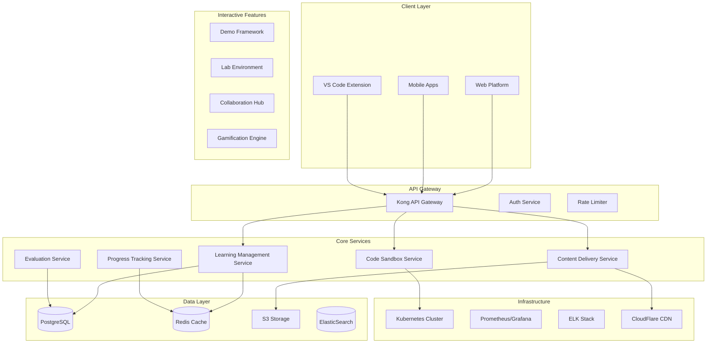

# OpenCode Course Technical Architecture

## 🏗️ System Architecture Overview

### High-Level Architecture Diagram



## 📋 Core Components

### 1. Interactive Demonstration Framework

#### Architecture
```yaml
demo_framework:
  name: "OpenCode Interactive Demo System"
  
  components:
    demo_engine:
      technology: "React + TypeScript"
      features:
        - Step-by-step code walkthroughs
        - Interactive code highlighting
        - Real-time execution visualization
        - Branching scenarios
        
    visualization_layer:
      technology: "D3.js + WebGL"
      features:
        - Algorithm visualization
        - Data structure animations
        - System architecture diagrams
        - Performance metrics graphs
        
    interaction_controller:
      technology: "WebSockets + RxJS"
      features:
        - Real-time user interactions
        - Multi-user demonstrations
        - Synchronized playback
        - Interactive Q&A overlay
```

#### Demo Types
```typescript
interface DemoType {
  concept: ConceptDemo;      // Explain programming concepts
  algorithm: AlgorithmDemo;   // Visualize algorithms
  architecture: SystemDemo;   // Show system designs
  debugging: DebugDemo;       // Interactive debugging
  performance: PerfDemo;      // Performance optimization
}

interface ConceptDemo {
  id: string;
  title: string;
  duration: number;
  interactionPoints: InteractionPoint[];
  codeSnippets: CodeSnippet[];
  visualizations: Visualization[];
  assessments: MicroAssessment[];
}
```

### 2. Code Sandbox Environments

#### Sandbox Architecture
```yaml
sandbox_service:
  name: "OpenCode Sandbox Platform"
  
  infrastructure:
    container_runtime: "Firecracker microVMs"
    orchestration: "Kubernetes"
    networking: "Istio service mesh"
    
  features:
    isolation:
      - Secure container isolation
      - Resource limits per user
      - Network segmentation
      - Temporary file systems
      
    languages:
      javascript:
        runtime: "Node.js 20"
        packages: "npm/yarn"
        frameworks: ["React", "Vue", "Express"]
        
      python:
        runtime: "Python 3.11"
        packages: "pip/poetry"
        frameworks: ["Django", "FastAPI", "Flask"]
        
      additional:
        - TypeScript
        - Go
        - Rust
        - Java
        - C#
        
    persistence:
      - Project snapshots
      - Version history
      - Collaborative editing
      - Git integration
```

#### Sandbox API
```typescript
interface SandboxAPI {
  // Sandbox lifecycle
  createSandbox(config: SandboxConfig): Promise<Sandbox>;
  destroySandbox(id: string): Promise<void>;
  
  // Code execution
  executeCode(sandbox: Sandbox, code: string): Promise<ExecutionResult>;
  runTests(sandbox: Sandbox, tests: Test[]): Promise<TestResults>;
  
  // Collaboration
  shareSession(sandbox: Sandbox, users: User[]): Promise<Session>;
  syncChanges(session: Session, changes: CodeChange[]): Promise<void>;
  
  // Persistence
  saveSnapshot(sandbox: Sandbox): Promise<Snapshot>;
  loadSnapshot(snapshotId: string): Promise<Sandbox>;
}
```

### 3. Automated Testing & Validation

#### Testing Framework
```yaml
testing_system:
  name: "OpenCode AutoTest Platform"
  
  components:
    test_runner:
      unit_testing:
        - Jest for JavaScript/TypeScript
        - pytest for Python
        - JUnit for Java
        - xUnit for C#
        
      integration_testing:
        - API testing with Supertest
        - E2E testing with Playwright
        - Database testing with TestContainers
        
      performance_testing:
        - Load testing with K6
        - Stress testing with Locust
        - Memory profiling
        
    validation_engine:
      code_quality:
        - ESLint/Prettier for JS
        - Black/Flake8 for Python
        - SonarQube integration
        
      security_scanning:
        - SAST with Semgrep
        - Dependency scanning
        - Container scanning
        
      plagiarism_detection:
        - Code similarity analysis
        - Pattern matching
        - ML-based detection
```

#### Automated Grading
```typescript
interface AutoGrader {
  // Test execution
  runTests(submission: CodeSubmission): Promise<TestReport>;
  
  // Code analysis
  analyzeCodeQuality(code: string): Promise<QualityReport>;
  checkBestPractices(code: string): Promise<PracticeReport>;
  
  // Performance evaluation
  measurePerformance(code: string, inputs: TestInput[]): Promise<PerfReport>;
  
  // Feedback generation
  generateFeedback(reports: Report[]): Promise<StudentFeedback>;
}
```

### 4. Progress Tracking & Gamification

#### Progress Tracking System
```yaml
progress_tracker:
  name: "OpenCode Progress Analytics"
  
  metrics:
    learning_metrics:
      - Lesson completion rate
      - Time spent per module
      - Exercise success rate
      - Project completion quality
      - Peer review participation
      
    skill_metrics:
      - Concept mastery levels
      - Language proficiency
      - Problem-solving speed
      - Code quality improvement
      - Architecture competency
      
    engagement_metrics:
      - Daily active time
      - Community participation
      - Help requests/given
      - Content interaction rate
      
  storage:
    real_time: "Redis with pub/sub"
    historical: "PostgreSQL with partitioning"
    analytics: "ClickHouse for OLAP"
```

#### Gamification Engine
```typescript
interface GamificationSystem {
  // Achievement system
  achievements: {
    coding: CodingAchievements;
    learning: LearningAchievements;
    community: CommunityAchievements;
    special: SpecialAchievements;
  };
  
  // Point system
  points: {
    experience: XPSystem;
    reputation: ReputationSystem;
    currency: VirtualCurrency;
  };
  
  // Leaderboards
  leaderboards: {
    global: GlobalLeaderboard;
    cohort: CohortLeaderboard;
    skill: SkillLeaderboard;
  };
  
  // Rewards
  rewards: {
    badges: Badge[];
    certificates: Certificate[];
    unlockables: Feature[];
  };
}

interface Achievement {
  id: string;
  name: string;
  description: string;
  icon: string;
  xpReward: number;
  rarity: 'common' | 'rare' | 'epic' | 'legendary';
  conditions: AchievementCondition[];
}
```

### 5. Multi-Language Support

#### Language Architecture
```yaml
language_support:
  name: "OpenCode Polyglot Platform"
  
  primary_languages:
    javascript:
      versions: ["ES2023", "TypeScript 5.0"]
      environments: ["Browser", "Node.js", "Deno"]
      testing: ["Jest", "Mocha", "Vitest"]
      
    python:
      versions: ["3.10", "3.11", "3.12"]
      environments: ["CPython", "PyPy"]
      testing: ["pytest", "unittest"]
      
  compilation_pipeline:
    frontend:
      - Babel transpilation
      - TypeScript compilation
      - WASM compilation
      
    backend:
      - JIT compilation caching
      - Multi-language runners
      - Polyglot debugging
      
  code_intelligence:
    - Language servers (LSP)
    - IntelliSense/autocomplete
    - Error diagnostics
    - Refactoring tools
    - Documentation lookup
```

#### Language Service API
```typescript
interface LanguageService {
  // Compilation
  compile(code: string, language: Language): Promise<CompiledCode>;
  transpile(code: string, target: Target): Promise<string>;
  
  // Execution
  execute(code: CompiledCode, input?: string): Promise<ExecutionResult>;
  debug(code: CompiledCode, breakpoints: Breakpoint[]): Promise<DebugSession>;
  
  // Intelligence
  autocomplete(code: string, position: Position): Promise<Completion[]>;
  diagnostics(code: string): Promise<Diagnostic[]>;
  
  // Translation
  convertCode(code: string, from: Language, to: Language): Promise<string>;
}
```

### 6. Deployment & Hosting Architecture

#### Infrastructure Design
```yaml
deployment_architecture:
  name: "OpenCode Cloud Infrastructure"
  
  hosting:
    primary: "AWS Multi-Region"
    regions: ["us-east-1", "eu-west-1", "ap-southeast-1"]
    failover: "Active-Active"
    
  compute:
    web_tier:
      service: "EKS (Kubernetes)"
      instances: "t3.large"
      scaling: "HPA 2-50 pods"
      
    api_tier:
      service: "EKS (Kubernetes)"
      instances: "c5.xlarge"
      scaling: "HPA 5-100 pods"
      
    sandbox_tier:
      service: "EKS with Firecracker"
      instances: "m5.2xlarge"
      scaling: "Cluster Autoscaler"
      
  storage:
    database:
      primary: "RDS PostgreSQL Multi-AZ"
      read_replicas: 3
      backup: "Continuous with PITR"
      
    object_storage:
      service: "S3"
      buckets:
        - content-delivery
        - user-projects
        - submission-archives
        
    cache:
      service: "ElastiCache Redis"
      configuration: "Cluster mode"
      
  networking:
    cdn: "CloudFlare Enterprise"
    load_balancer: "ALB with WAF"
    api_gateway: "Kong on EKS"
    service_mesh: "Istio"
```

#### CI/CD Pipeline
```yaml
cicd_pipeline:
  source_control:
    platform: "GitHub Enterprise"
    branching: "GitFlow"
    
  pipeline_stages:
    - name: "Build"
      steps:
        - Lint code
        - Run unit tests
        - Build containers
        - Security scan
        
    - name: "Test"
      steps:
        - Integration tests
        - E2E tests
        - Performance tests
        - Accessibility tests
        
    - name: "Deploy Staging"
      steps:
        - Deploy to staging
        - Smoke tests
        - Manual approval
        
    - name: "Deploy Production"
      steps:
        - Blue-green deployment
        - Health checks
        - Monitoring alerts
        - Rollback ready
        
  tools:
    ci: "GitHub Actions"
    cd: "ArgoCD"
    monitoring: "Datadog"
    secrets: "AWS Secrets Manager"
```

## 🔧 Technical Implementation Details

### Database Schema (Core Tables)

```sql
-- Users and Authentication
CREATE TABLE users (
    id UUID PRIMARY KEY DEFAULT gen_random_uuid(),
    email VARCHAR(255) UNIQUE NOT NULL,
    username VARCHAR(50) UNIQUE NOT NULL,
    full_name VARCHAR(255),
    avatar_url TEXT,
    created_at TIMESTAMP DEFAULT CURRENT_TIMESTAMP,
    updated_at TIMESTAMP DEFAULT CURRENT_TIMESTAMP,
    last_login TIMESTAMP,
    status VARCHAR(50) DEFAULT 'active'
);

-- Learning Progress
CREATE TABLE user_progress (
    id UUID PRIMARY KEY DEFAULT gen_random_uuid(),
    user_id UUID REFERENCES users(id),
    module_id UUID REFERENCES modules(id),
    lesson_id UUID REFERENCES lessons(id),
    status VARCHAR(50) DEFAULT 'not_started',
    progress_percentage DECIMAL(5,2) DEFAULT 0,
    started_at TIMESTAMP,
    completed_at TIMESTAMP,
    time_spent_minutes INTEGER DEFAULT 0,
    UNIQUE(user_id, lesson_id)
);

-- Code Submissions
CREATE TABLE code_submissions (
    id UUID PRIMARY KEY DEFAULT gen_random_uuid(),
    user_id UUID REFERENCES users(id),
    exercise_id UUID REFERENCES exercises(id),
    language VARCHAR(50) NOT NULL,
    code TEXT NOT NULL,
    test_results JSONB,
    score DECIMAL(5,2),
    feedback TEXT,
    submitted_at TIMESTAMP DEFAULT CURRENT_TIMESTAMP,
    execution_time_ms INTEGER,
    memory_used_mb INTEGER
);

-- Gamification
CREATE TABLE user_achievements (
    id UUID PRIMARY KEY DEFAULT gen_random_uuid(),
    user_id UUID REFERENCES users(id),
    achievement_id UUID REFERENCES achievements(id),
    earned_at TIMESTAMP DEFAULT CURRENT_TIMESTAMP,
    progress JSONB,
    UNIQUE(user_id, achievement_id)
);

CREATE TABLE user_points (
    id UUID PRIMARY KEY DEFAULT gen_random_uuid(),
    user_id UUID REFERENCES users(id),
    point_type VARCHAR(50) NOT NULL,
    points INTEGER NOT NULL,
    reason TEXT,
    metadata JSONB,
    earned_at TIMESTAMP DEFAULT CURRENT_TIMESTAMP
);
```

### API Design

```yaml
api_design:
  version: "v1"
  base_url: "https://api.opencode.education/v1"
  
  authentication:
    type: "JWT"
    refresh_token: true
    expiry: "24h"
    
  endpoints:
    # Learning Content
    GET /modules
    GET /modules/{id}
    GET /modules/{id}/lessons
    GET /lessons/{id}
    GET /lessons/{id}/content
    
    # Progress Tracking
    GET /users/{id}/progress
    POST /users/{id}/progress
    GET /users/{id}/achievements
    
    # Code Execution
    POST /sandbox/create
    POST /sandbox/{id}/execute
    POST /sandbox/{id}/test
    DELETE /sandbox/{id}
    
    # Submissions
    POST /exercises/{id}/submit
    GET /exercises/{id}/submissions
    GET /submissions/{id}
    
    # Gamification
    GET /leaderboards
    GET /achievements
    GET /users/{id}/points
    
  rate_limiting:
    default: "1000 req/hour"
    sandbox: "100 req/hour"
    execution: "50 req/hour"
```

### Security Architecture

```yaml
security_architecture:
  authentication:
    primary: "Auth0"
    mfa: "TOTP/SMS"
    sso: "SAML/OAuth2"
    
  authorization:
    model: "RBAC with ABAC"
    roles:
      - student
      - instructor
      - teaching_assistant
      - admin
      
  data_protection:
    encryption_at_rest: "AES-256"
    encryption_in_transit: "TLS 1.3"
    key_management: "AWS KMS"
    
  sandbox_security:
    isolation: "gVisor"
    network: "No external access"
    resource_limits:
      cpu: "1 core"
      memory: "512MB"
      disk: "100MB"
      execution_time: "30s"
      
  compliance:
    - GDPR
    - COPPA
    - FERPA
    - SOC2
```

### Monitoring & Observability

```yaml
monitoring_stack:
  metrics:
    collection: "Prometheus"
    visualization: "Grafana"
    alerting: "AlertManager"
    
  logging:
    aggregation: "Fluentd"
    storage: "Elasticsearch"
    analysis: "Kibana"
    
  tracing:
    instrumentation: "OpenTelemetry"
    backend: "Jaeger"
    
  dashboards:
    - System health
    - User engagement
    - Learning analytics
    - Performance metrics
    - Error tracking
    
  alerts:
    - High error rate
    - Slow response time
    - Low completion rate
    - Security incidents
    - Resource exhaustion
```

## 📊 Scalability Considerations

### Performance Targets
- **Concurrent Users**: 100,000+
- **Page Load Time**: < 2 seconds
- **API Response Time**: < 200ms (p95)
- **Code Execution Time**: < 5 seconds
- **Availability**: 99.95% uptime

### Scaling Strategy
```yaml
scaling_strategy:
  horizontal_scaling:
    - Auto-scaling groups for web/API tiers
    - Read replicas for databases
    - Sharded sandbox environments
    - CDN for static content
    
  vertical_scaling:
    - GPU instances for ML workloads
    - High-memory instances for analytics
    - Optimized instances for databases
    
  caching_strategy:
    - CDN for static assets
    - Redis for session data
    - Application-level caching
    - Database query caching
    
  optimization:
    - Code splitting for frontend
    - Lazy loading of content
    - Image optimization
    - API response compression
```

## 🔄 Disaster Recovery

### Backup Strategy
- **Database**: Continuous replication with point-in-time recovery
- **User Data**: Daily snapshots to S3 with versioning
- **Code Repositories**: Git-based with multiple remotes
- **Infrastructure**: Infrastructure as Code with version control

### Recovery Procedures
- **RTO**: 4 hours
- **RPO**: 1 hour
- **Automated failover** for critical services
- **Regular disaster recovery drills**
- **Runbook documentation** for manual procedures

## 📈 Future Enhancements

### Planned Features
1. **AI-Powered Learning Assistant**
   - Personalized learning paths
   - Code review and suggestions
   - Natural language to code
   
2. **Advanced Analytics**
   - Learning pattern analysis
   - Predictive completion rates
   - Skill gap identification
   
3. **Mobile Native Apps**
   - Offline learning capability
   - Push notifications
   - Mobile code editor
   
4. **Virtual Reality Labs**
   - 3D visualization of algorithms
   - Immersive debugging
   - Collaborative VR spaces
   
5. **Blockchain Certificates**
   - Verifiable credentials
   - Skill NFTs
   - Decentralized reputation

## 🎯 Success Metrics

### Technical KPIs
- **System Uptime**: > 99.95%
- **API Latency**: < 200ms p95
- **Error Rate**: < 0.1%
- **Code Execution Success**: > 99%
- **Deployment Frequency**: Daily
- **MTTR**: < 30 minutes

### Learning KPIs
- **Course Completion**: > 80%
- **Student Satisfaction**: > 4.5/5
- **Code Quality Improvement**: > 40%
- **Job Placement Rate**: > 85%
- **Knowledge Retention**: > 70% after 6 months

---

This technical architecture provides a robust, scalable foundation for the OpenCode course platform, ensuring an exceptional learning experience while maintaining security, performance, and reliability at scale.